# 🚀 WebCareer - Full Stack Job Portal & Career Management System


## 📌 Project Overview

**WebCareer** is a production-ready **Full Stack Job Portal & Career Management System** built using **Laravel, PHP, Bootstrap 5, JavaScript, HTML5, CSS3, and MySQL**.

The platform provides a complete hiring ecosystem where **Employers** can create company profiles, publish job vacancies, manage applicants, and monitor recruitment, while **Job Seekers** can search jobs, apply online, upload resumes, manage profiles, and track their applications.

This project demonstrates real-world software architecture, clean UI/UX, authentication, authorization, responsive layouts, relational databases, and scalable Laravel development practices.

---

# ✨ Key Features

## 👨‍💼 Employer Features

- Company Profile Management
- Company Logo Upload
- Create New Job
- Edit Job
- Delete Job
- View Job Details
- Manage Posted Jobs
- View Applicants
- Dashboard Analytics
- Job Status Management

---

## 👤 Job Seeker Features

- User Registration & Login
- Professional Dashboard
- Complete Profile Management
- Resume Upload
- Search Jobs
- Apply Online
- Saved Jobs
- Track Applied Jobs
- Account Settings

---

## 💼 Job Management

- Publish New Jobs
- Salary Range
- Experience Level
- Job Categories
- Job Types
- Vacancies
- Skills Required
- Job Description
- Requirements
- Company Information

---

## 🔍 Advanced Search & Filters

- Keyword Search
- Location Search
- Full-Time Jobs
- Part-Time Jobs
- Remote Jobs
- Contract Jobs
- Internship Jobs
- Experience Filter
- Salary Filter
- Date Posted Filter

---

## 📊 Dashboard

- Total Jobs
- Active Jobs
- Total Views
- Applicants Count
- Profile Management
- Job Statistics
- Activity Tracking

---

## 🔐 Authentication & Security

- Secure Authentication
- Role-Based Authorization
- Session Management
- Form Validation
- Password Encryption
- CSRF Protection
- Protected Routes

---

## 📱 Responsive Design

- Desktop
- Laptop
- Tablet
- Mobile

Built with **Bootstrap 5** to ensure a fully responsive and modern user experience across all devices.

---

# 🛠 Technology Stack

### Backend

- Laravel
- PHP
- MySQL

### Frontend

- Bootstrap 5
- JavaScript (ES6)
- HTML5
- CSS3

### Development Tools

- Composer
- NPM
- Git
- GitHub

---

# 📂 Modules

- Landing Page
- Authentication
- Employer Dashboard
- Job Seeker Dashboard
- Company Management
- Job Management
- Available Jobs
- Job Details
- Applied Jobs
- Profile Management
- Settings
- About Page
- Services Page
- Contact Page

---

# 🎯 Highlights

- Production-Level Architecture
- Clean MVC Structure
- Professional UI/UX
- Fully Responsive Design
- Reusable Components
- Scalable Codebase
- Real-World Recruitment Workflow
- Employer & Candidate Portals
- Modern Dashboard
- Secure Authentication
- Optimized Database Design

---

# 📸 Screenshots

## 🏠 Home Page


---

## 🔐 Login

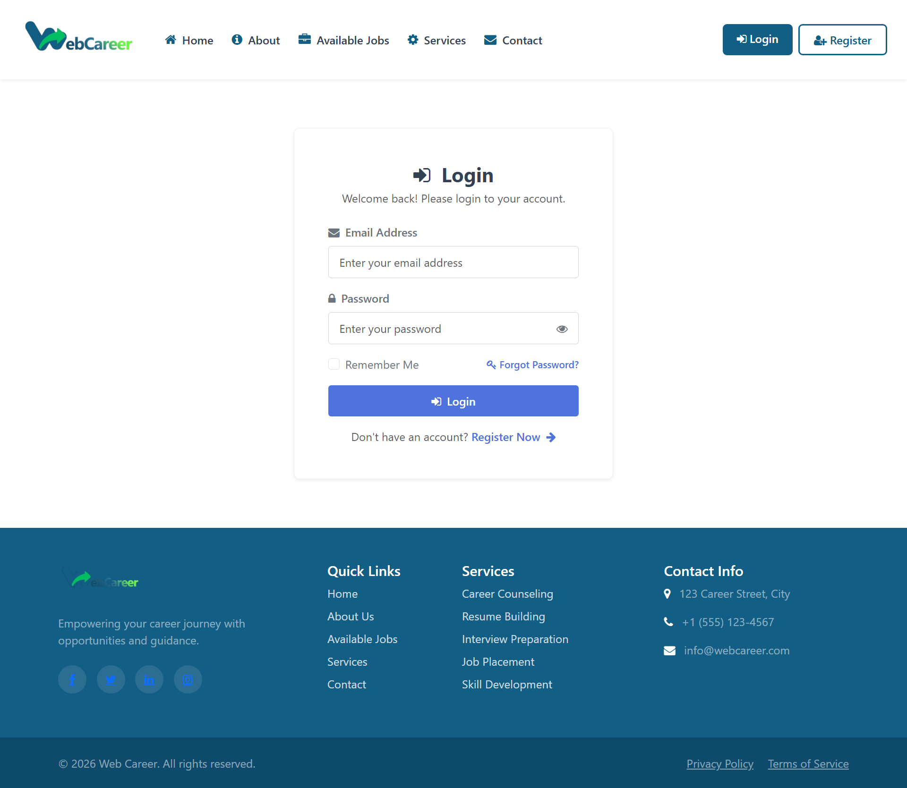

---

## 📝 Register

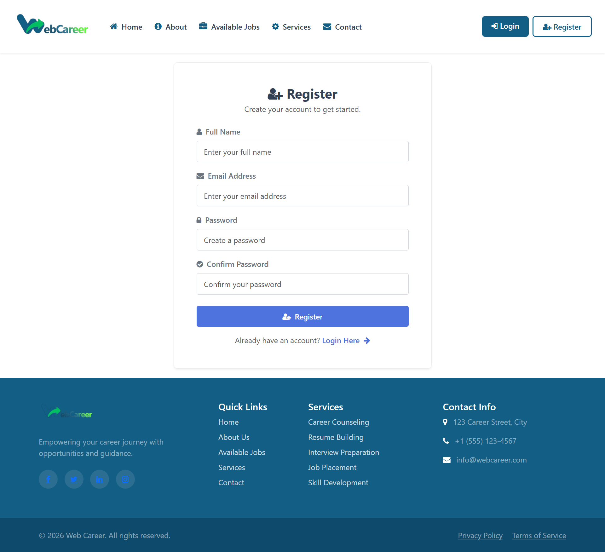

---

## 💼 Available Jobs

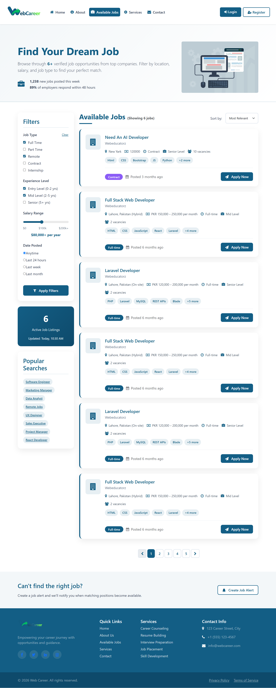

---

## 📄 Job Details

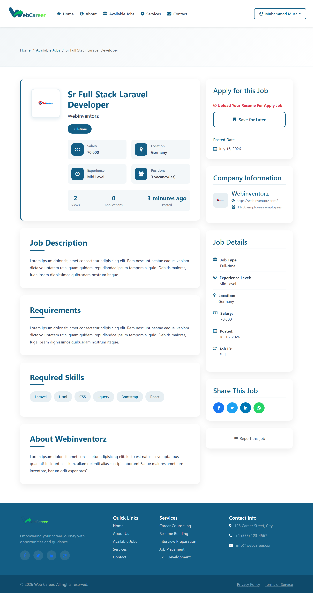

---

## ℹ️ About Page


---

## 🛠 Services

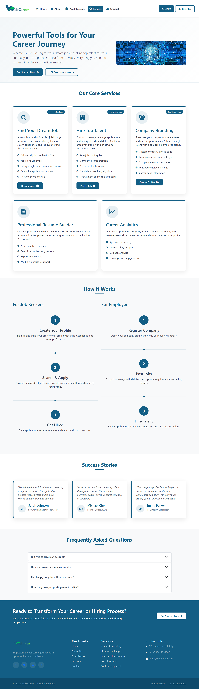

---

## 📞 Contact

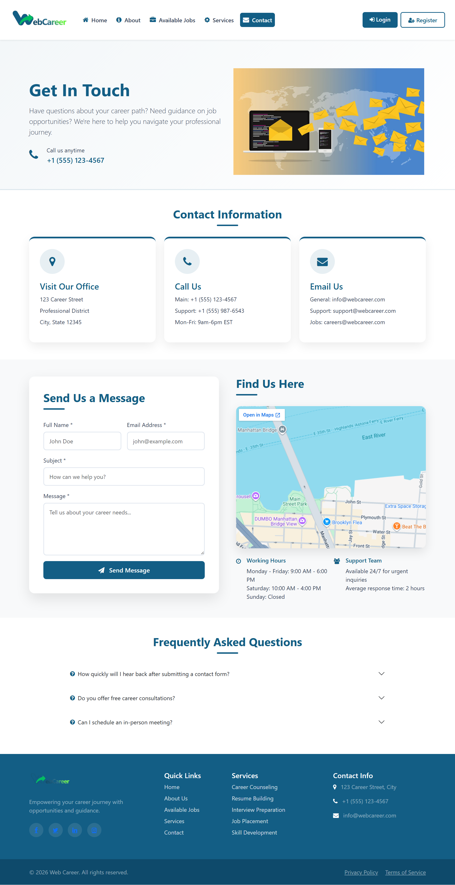

---

# 👨‍💼 Employer Dashboard

## 📊 Dashboard

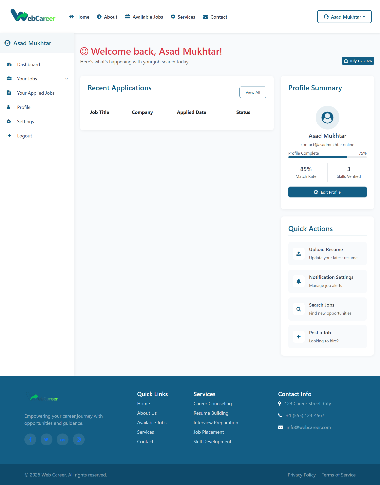

---

## 🏢 Create Company

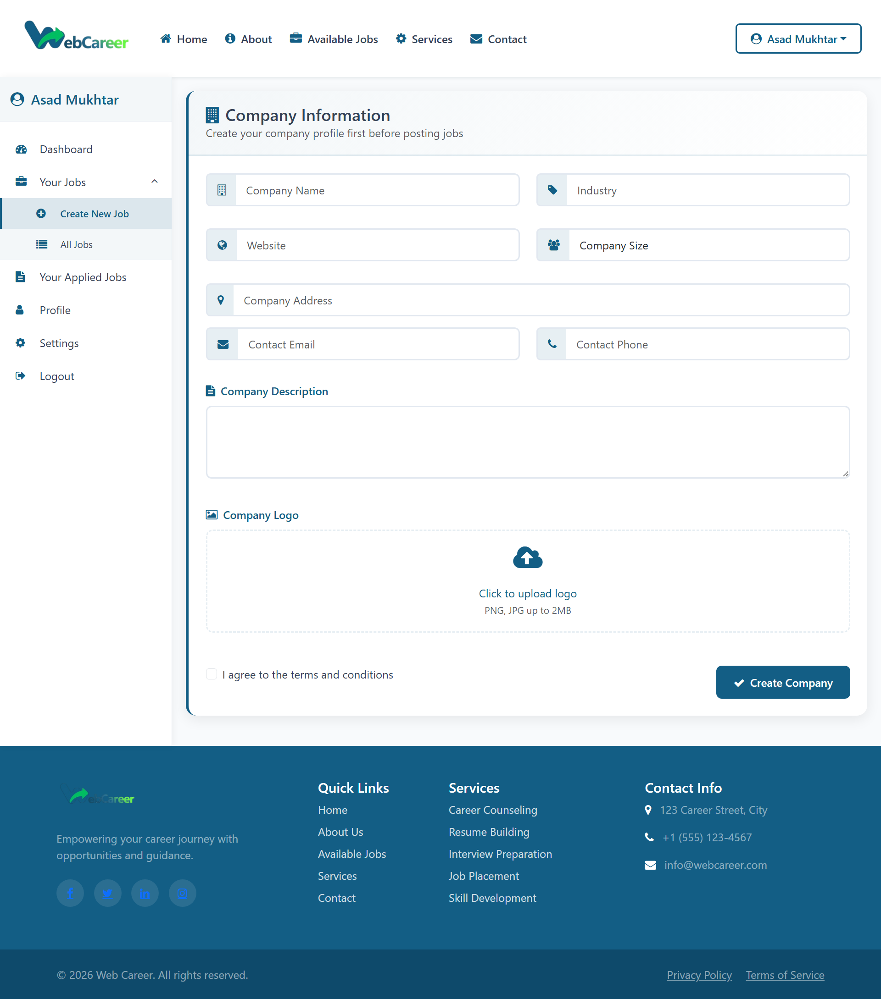

---

## 💼 Create New Job

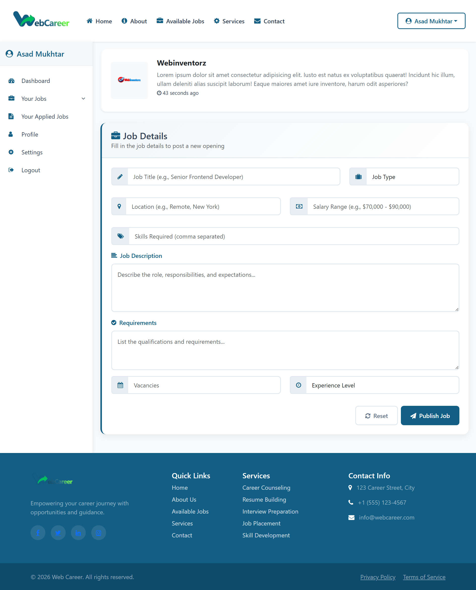

---

## 📋 My Jobs

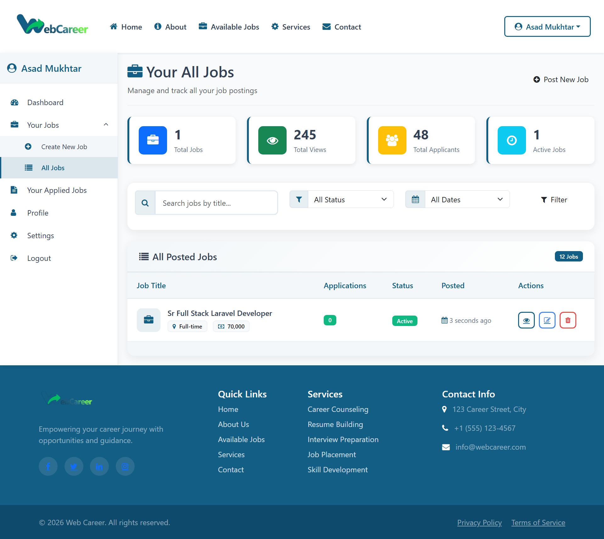

---

## 📄 Job Details

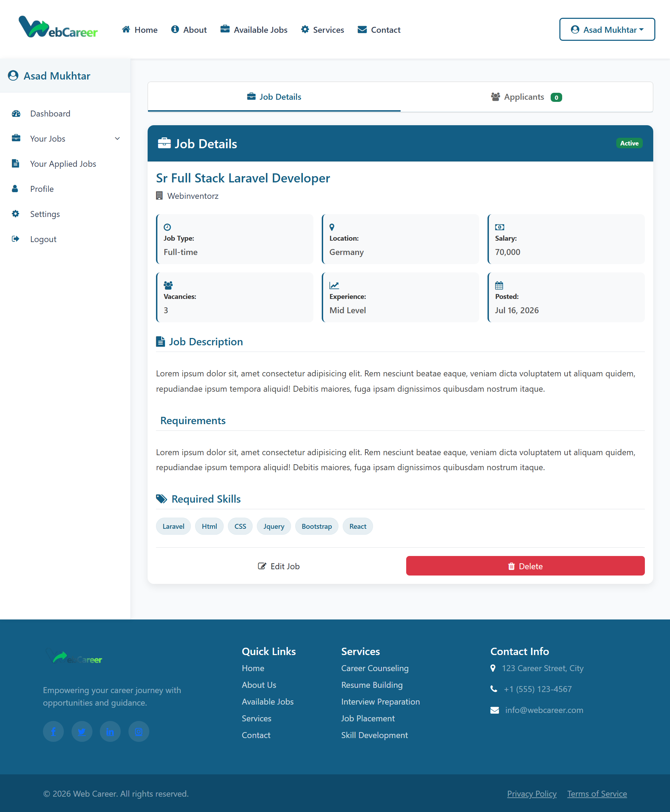

---

## 👤 Profile

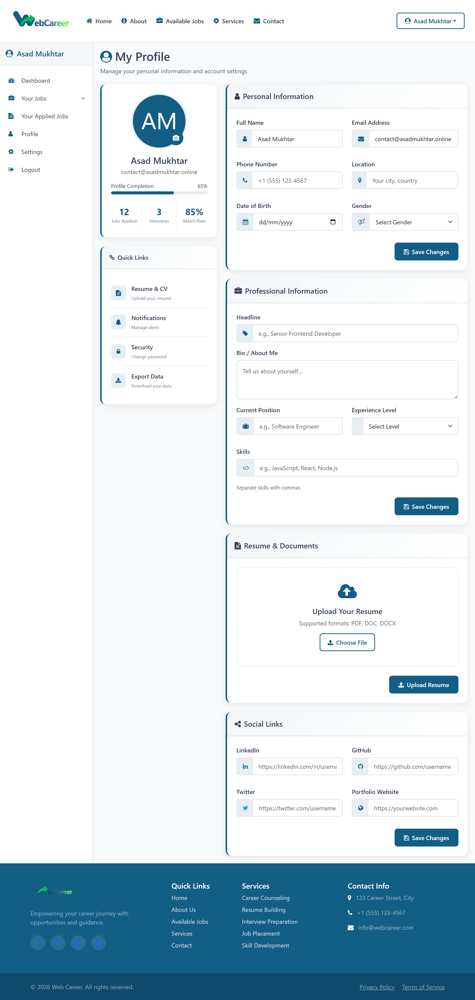

---

## 📝 Applied Jobs

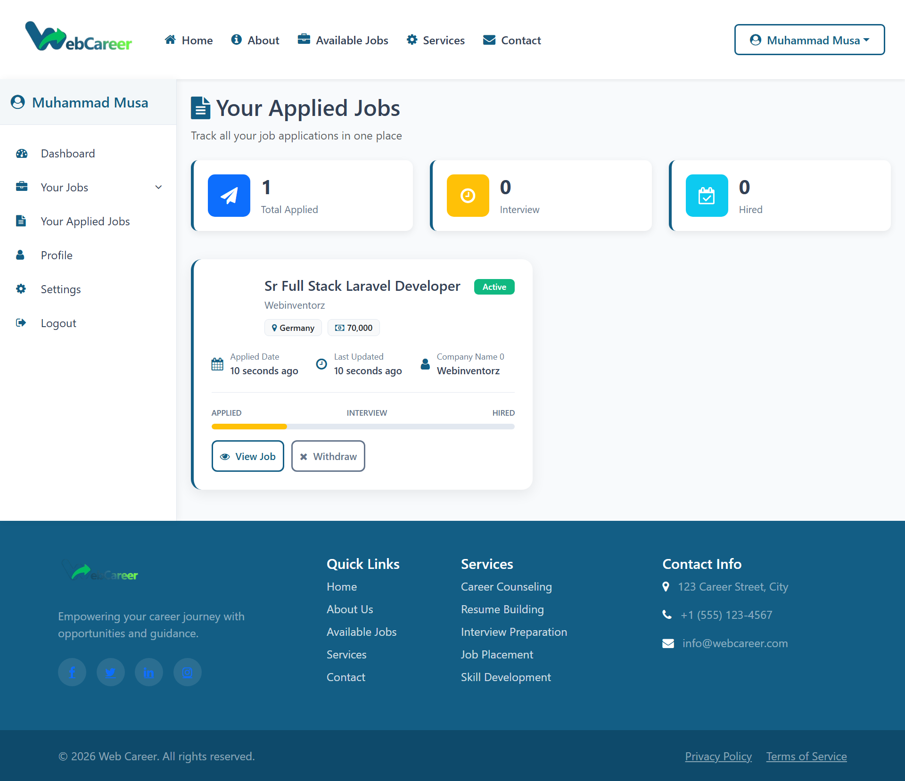

---

## ⚙️ Settings

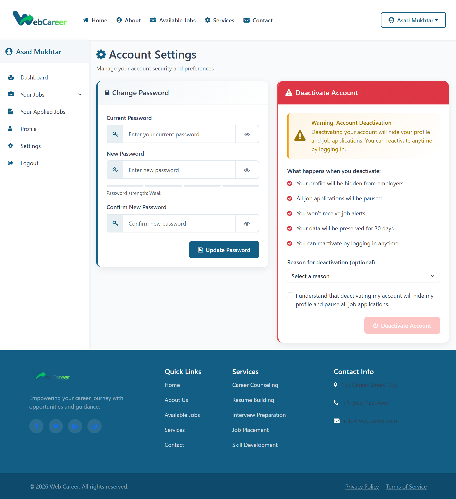

---

# 📁 Project Structure

```
app/
bootstrap/
config/
database/
public/
resources/
routes/
storage/
screenshots/
```

---

# 🚀 Installation

```bash
git clone https://github.com/your-username/webcareer-job-portal.git

cd webcareer-job-portal

composer install

cp .env.example .env

php artisan key:generate

php artisan migrate --seed

npm install

npm run build

php artisan serve
```

---

# 📈 Learning Outcomes

This project demonstrates experience with:

- Laravel MVC Architecture
- Authentication & Authorization
- CRUD Operations
- Role-Based Access Control
- Database Relationships
- File Uploads
- Responsive UI Development
- Bootstrap 5
- JavaScript
- Form Validation
- Dashboard Development
- Clean Code Practices
- Production-Level Project Structure

---

# 🌍 Perfect For

- Full Stack Developer Portfolio
- Laravel Developer Portfolio
- Backend Developer Portfolio
- Germany Job Applications
- International Software Engineer Applications
- GitHub Showcase
- Freelance Portfolio

---

# 👨‍💻 Developer

**Muhammad Asad Mukhtar**

Full Stack Web Developer

Laravel • PHP • JavaScript • Bootstrap • MySQL

---

## ⭐ If you like this project, don't forget to give it a Star!